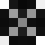
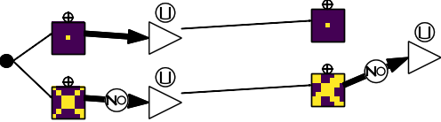

# Binary Multi Channel Morphological Neural Network

This repository is linked to a submission at [DGMM 2022](https://dgmm2022.sciencesconf.org/). The preprint can be seen [here](https://arxiv.org/abs/2204.08768).

It contains:
- the code used for experiments, as well as the seed used
- complementary figures that could not be added in the preprint because of space issues

# Code

We present the code to reproduce all results of table 1 of the [preprint](https://arxiv.org/abs/2204.08768). For each case, arguments are found in the folder `deep_morpho/args_folder`.

## Configuration
The code was tested on Ubuntu 18.04.6 LTS on a Quadro RTX 6000 GPU and Intel(R) Xeon(R) W-2265 CPU @ 3.5GHz. In each argument file of `args_folder`, we put `num_workers=20` for the dataloaders. If you do not have enough CPU cores, you can put `num_workers=0`. However this may break replicability.

## Requirements

See `requirements.txt`. We use [PyTorch](https://pytorch.org/) and [Pytorch Lightning](https://pytorch-lightning.readthedocs.io/en/latest/).
We use torch version 1.8.1 and pytorch lightning version 1.3.1.
If you use `pip`, please ensure that you have the latest version.
>pip install --upgrade pip

## Launch the BiMoNN training
First choose which configuration in the `deep_morpho/args.py` file. By default, you one configuration.  Then run the training with
>python deep_morpho/train_net.py

An temporary `results/temporary{nb}` file will be created. This will be deleted at the end of the training. If the training does not finish for any reason, you can delete it manually without issues. Its purpose is to save the code.

An experiment folder will also be created in `results/{TB}`. Inside you will find: 
- the final state of the model inside `{TB}/version_0/checkpoints`.
- the tensorboard files. To launch tensorboard: 
>tensorboard --logdir results/{TB}
- the code used to run the experiment
- a set of observables under `{TB}/version_0/observables`
    - the metric values
    - the step until convergence
    - the learned weights (`PlotWeights`) and binarized weights (`ShowClosestSelemBinary`)
    - the summarized learned model and its binarized version (`PlotBimonn`)

## Launch the bibliography comparison
First choose which configuration in the `biblio_comparison/args.py` file. You can choose the model and the dataset. The morphological operations are defined in `biblio_comparison/arg_morp_ops_diskorect.py` and `biblio_comparison/arg_morp_ops_mnist.py`. By default, all configurations will be launched. Comment the ones you want to avoid.
>python deep_morpho/biblio_comparison.py

The same experiment folder as the bimonn will be created.

# Obtained results

## Learned weights

<table>
    <tr>
        <td>
            Dataset
        </td>
        <td colspan="3">
            Diskorect
        </td>
        <td colspan="3">
            MNIST
        </td>
        <td colspan="3">
            Inverted MNIST
        </td>
    </tr>
    <tr>
        <td>
            Operation
        </td>
        <td> Disk </td><td> Stick</td> <td> Cross</td> <td> Disk </td><td> Stick</td> <td> Cross</td> <td> Disk </td><td> Stick</td> <td> Cross</td>
    </tr>
    <tr>
        <td>Target</td>
        <td></img></td><td></img></td><td></img></td>
        <td></img></td><td></img></td><td></img></td>
        <td></img></td><td></img></td><td></img></td>
    </tr>
    <tr>
        <td>dilation</td>
        <td></img></td><td></img></td><td></img></td>
        <td></img></td><td></img></td><td></img></td>
        <td></img></td><td></img></td><td></img></td>
    </tr>
    <tr>
        <td>erosion</td>
        <td></img></td><td></img></td><td></img></td>
        <td></img></td><td></img></td><td></img></td>
        <td></img></td><td></img></td><td></img></td>
    </tr>
    <tr>
        <td>opening</td>
        <td></img></img></td><td></img></img></td><td></img></img></td>
        <td></img></img></td><td></img></img></td><td></img></img></td>
        <td></img></img></td><td></img></img></td><td></img></img></td>
    </tr>
    <tr>
        <td>closing</td>
        <td></img></img></td><td></img></img></td><td></img></img></td>
        <td></img></img></td><td></img></img></td><td></img></img></td>
        <td></img></img></td><td></img></img></td><td></img></img></td>
    </tr>
</table>

## Binarized weights

<table>
    <tr>
        <td>
            Dataset
        </td>
        <td colspan="3">
            Diskorect
        </td>
        <td colspan="3">
            MNIST
        </td>
        <td colspan="3">
            Inverted MNIST
        </td>
    </tr>
    <tr>
        <td>
            Operation
        </td>
        <td> Disk </td><td> Stick</td> <td> Cross</td> <td> Disk </td><td> Stick</td> <td> Cross</td> <td> Disk </td><td> Stick</td> <td> Cross</td>
    </tr>
    <tr>
        <td>Target</td>
        <td></img></td><td></img></td><td></img></td>
        <td></img></td><td></img></td><td></img></td>
        <td></img></td><td></img></td><td></img></td>
    </tr>
    <tr>
        <td>dilation</td>
        <td></img></td><td></img></td><td></img></td>
        <td></img></td><td></img></td><td></img></td>
        <td></img></td><td></img></td><td></img></td>
    </tr>
    <tr>
        <td>erosion</td>
        <td></img></td><td></img></td><td></img></td>
        <td></img></td><td></img></td><td></img></td>
        <td></img></td><td></img></td><td></img></td>
    </tr>
    <tr>
        <td>opening</td>
        <td></img></img></td><td></img></img></td><td></img></img></td>
        <td></img></img></td><td></img></img></td><td></img></img></td>
        <td></img></img></td><td></img></img></td><td></img></img></td>
    </tr>
    <tr>
        <td>closing</td>
        <td></img></img></td><td></img></img></td><td></img></img></td>
        <td></img></img></td><td></img></img></td><td></img></img></td>
        <td></img></img></td><td></img></img></td><td></img></img></td>
    </tr>
</table>

## Top Hat Results

### Black TopHat

<table>
    <tr>
        <td>Dataset</td><td>Selem</td><td>Learned</td><td>Binarized</td>
    </tr>
    <tr>
        <td>Diskorect</td><td>Disk</td><td></img></td><td></img></td>
    </tr>
    <tr>
        <td>Diskorect</td><td>Stick</td><td></img></td><td></img></td>
    </tr>
    <tr>
        <td>Diskorect</td><td>Cross</td><td></img></td><td></img></td>
    </tr>
    <tr>
        <td>MNIST</td><td>Disk</td><td></img></td><td></img></td>
    </tr>
    <tr>
        <td>MNIST</td><td>Stick</td><td></img></td><td></img></td>
    </tr>
    <tr>
        <td>MNIST</td><td>Cross</td><td></img></td><td></img></td>
    </tr>
    <tr>
        <td>Inverted MNIST</td><td>Disk</td><td></img></td><td></img></td>
    </tr>
    <tr>
        <td>Inverted MNIST</td><td>Stick</td><td></img></td><td></img></td>
    </tr>
    <tr>
        <td>Inverted MNIST</td><td>Cross</td><td></img></td><td></img></td>
    </tr>
    
</table>

### White TopHat

<table>
    <tr>
        <td>Dataset</td><td>Selem</td><td>Learned</td><td>Binarized</td>
    </tr>
    <tr>
        <td>Diskorect</td><td>Disk</td><td></img></td><td></img></td>
    </tr>
    <tr>
        <td>Diskorect</td><td>Stick</td><td></img></td><td></img></td>
    </tr>
    <tr>
        <td>Diskorect</td><td>Cross</td><td></img></td><td></img></td>
    </tr>
    <tr>
        <td>MNIST</td><td>Disk</td><td></img></td><td></img></td>
    </tr>
    <tr>
        <td>MNIST</td><td>Stick</td><td></img></td><td></img></td>
    </tr>
    <tr>
        <td>MNIST</td><td>Cross</td><td></img></td><td></img></td>
    </tr>
    <tr>
        <td>Inverted MNIST</td><td>Disk</td><td></img></td><td></img></td>
    </tr>
    <tr>
        <td>Inverted MNIST</td><td>Stick</td><td></img></td><td></img></td>
    </tr>
    <tr>
        <td>Inverted MNIST</td><td>Cross</td><td></img></td><td></img></td>
    </tr>
    
</table>
